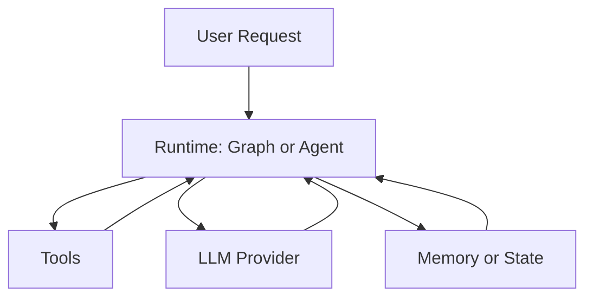

# Oris

**A programmable execution runtime for AI agents.**

[](https://crates.io/crates/oris-runtime)
[](https://docs.rs/oris-runtime)

Oris is not a prompt framework.

It is a runtime layer that lets software systems *execute reasoning*, not just generate text.

Modern LLM applications are no longer single requests.
They are long-running processes: planning, tool use, memory updates, retries, and human approval.

Today this logic lives in ad-hoc code, background jobs, and fragile queues.

Oris turns that into a **first-class execution system**.

---

## What Oris actually provides

Oris is closer to **Temporal / Ray** than to a chat SDK.

It provides a persistent execution environment for agentic workloads:

* Stateful execution graphs
* Durable checkpoints
* Interruptible runs (human-in-the-loop)
* Tool calling as system actions
* Multi-step planning loops
* Deterministic replay
* Recovery after crash or deploy

Instead of writing:

> "call LLM → parse → call tool → retry → store memory → schedule task"

You define an execution graph, and the runtime runs it.

---

## Why this exists

LLMs changed backend architecture.

We are moving from:

request → response

to:

goal → process → decisions → actions → memory → continuation

This is not an API problem anymore.

It is an **execution problem**.

Oris is an attempt to build the execution layer for software that *thinks before it acts*.

**Positioning:** Oris is the execution kernel for reasoning processes: durable, interruptible, and replayable by design. Unlike generic workflow engines (e.g. Temporal), Oris models *reasoning*—multi-step, non-deterministic decisions involving LLMs and tools—as a first-class execution model with its own state, interrupt, and replay semantics. See [Oris 2.0 Strategy & Evolution Blueprint](docs/ORIS_2.0_STRATEGY.md) for architecture, axioms, and roadmap.

---

## Mental model

If databases manage data
and message queues manage communication

**Oris manages reasoning processes.**

---

## What you can build with it

* autonomous coding agents
* long-running research agents
* human-approval workflows
* retrieval-augmented systems
* operational copilots
* AI operations pipelines

---

## Status

Early but functional.
The runtime, graph execution, and agent loop are implemented and usable today.

---

## Quick start (30 seconds)

Add the crate and set your API key:

```bash
cargo add oris-runtime
export OPENAI_API_KEY="your-key"
```

Minimal LLM call:

```rust
use oris_runtime::{language_models::llm::LLM, llm::openai::OpenAI};

#[tokio::main]
async fn main() -> Result<(), Box<dyn std::error::Error>> {
    let llm = OpenAI::default();
    let response = llm.invoke("What is Rust?").await?;
    println!("{}", response);
    Ok(())
}
```

Hello-world state graph (no API key needed):

```rust
use oris_runtime::graph::{function_node, MessagesState, StateGraph, END, START};
use oris_runtime::schemas::messages::Message;

#[tokio::main]
async fn main() -> Result<(), Box<dyn std::error::Error>> {
    let mock_llm = function_node("mock_llm", |_state: &MessagesState| async move {
        use std::collections::HashMap;
        let mut update = HashMap::new();
        update.insert(
            "messages".to_string(),
            serde_json::to_value(vec![Message::new_ai_message("hello world")])?,
        );
        Ok(update)
    });

    let mut graph = StateGraph::<MessagesState>::new();
    graph.add_node("mock_llm", mock_llm)?;
    graph.add_edge(START, "mock_llm");
    graph.add_edge("mock_llm", END);

    let compiled = graph.compile()?;
    let initial_state = MessagesState::with_messages(vec![Message::new_human_message("hi!")]);
    let _final_state = compiled.invoke(initial_state).await?;
    Ok(())
}
```

## Architecture



## Key concepts

- **State graphs** — Define workflows as directed graphs; run, stream, and optionally persist state (e.g. SQLite or in-memory).
- **Agents and tools** — Give agents tools (search, filesystem, custom); use multi-agent routers and subagents.
- **Persistence and interrupts** — Checkpoint state, resume runs, and pause for human approval or review.

See the [examples](crates/oris-runtime/examples/) directory for runnable code.

## Public API (stable)

The following modules are the **stable surface** for building on Oris. Prefer these entry points; other modules may change in 0.1.x.

| Entry | Purpose |
|-------|---------|
| `oris_runtime::graph` | State graphs, execution, persistence, interrupts, trace (`StateGraph`, `MessagesState`, checkpointer, `interrupt`/resume, `InvokeResult.trace`, `TraceEvent`) |
| `oris_runtime::agent` | Agent loop, tools, Deep Agent (planning, skills) |
| `oris_runtime::tools` | Tool trait and built-in tools |

State types (e.g. `graph::MessagesState`, `graph::State`) are part of the stable graph API. [Full API docs](https://docs.rs/oris-runtime).

## Install and config

```bash
cargo add oris-runtime
# With a vector store (e.g. PostgreSQL):
cargo add oris-runtime --features postgres
# With SQLite persistence (production-ready checkpoints):
cargo add oris-runtime --features sqlite-persistence
# With Ollama (local):
cargo add oris-runtime --features ollama
```

For durable execution across process restarts, use the `sqlite-persistence` feature and see the [durable_agent_job_sqlite](crates/oris-runtime/examples/durable_agent_job_sqlite.rs) example.

Common environment variables:

| Provider   | Variable           |
|-----------|--------------------|
| OpenAI    | `OPENAI_API_KEY`   |
| Anthropic | `ANTHROPIC_API_KEY` |
| Ollama    | `OLLAMA_HOST` (optional, default `http://localhost:11434`) |

## Examples and docs

- [Hello World graph](crates/oris-runtime/examples/graph_hello_world.rs)
- [Durable agent job](crates/oris-runtime/examples/durable_agent_job.rs) — interrupt, restart, resume with same `thread_id`; state is checkpointed so it survives process restarts.
- [Durable agent job with SQLite](crates/oris-runtime/examples/durable_agent_job_sqlite.rs) — same flow with SQLite persistence (run with `--features sqlite-persistence`).
- [CLI durable job](crates/oris-runtime/examples/cli_durable_job.rs) — minimal operator CLI: `run`, `list`, `resume` (requires `--features sqlite-persistence`).
- [Agent with tools](crates/oris-runtime/examples/agent.rs)
- [Streaming](crates/oris-runtime/examples/graph_streaming.rs)
- [Persistence](crates/oris-runtime/examples/graph_persistence_basic.rs)
- [Deep agent (planning + filesystem)](crates/oris-runtime/examples/deep_agent_basic.rs)

[API documentation](https://docs.rs/oris-runtime) · [Examples directory](crates/oris-runtime/examples/)

## License and attribution

MIT. This project includes code derived from [langchain-rust](https://github.com/langchain-ai/langchain-rust); see [LICENSE](LICENSE).

## Links

- [Crates.io](https://crates.io/crates/oris-runtime)
- [GitHub](https://github.com/fanjia1024/oris)
- [docs.rs](https://docs.rs/oris-runtime)
