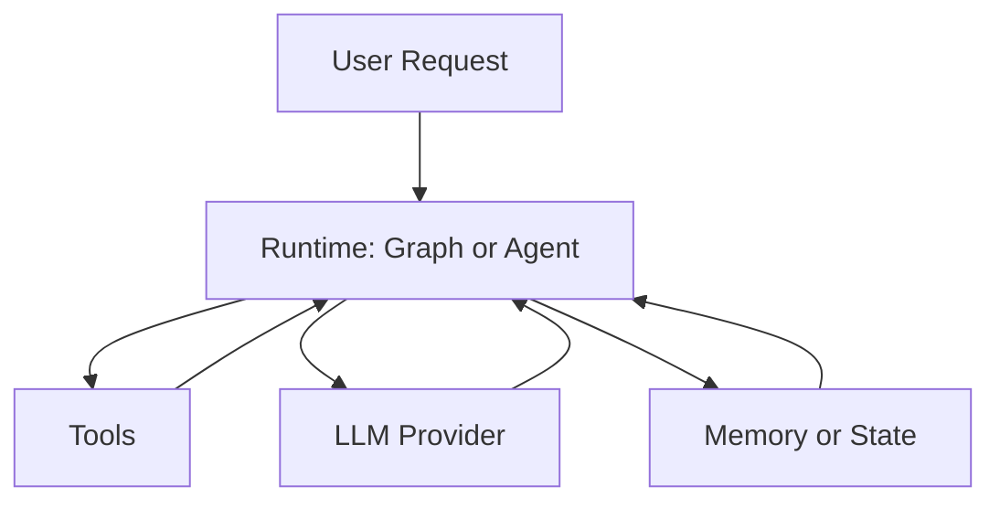

# Oris

**Oris is an execution runtime for software that reasons before it acts.**

[](https://crates.io/crates/oris-runtime)
[](https://docs.rs/oris-runtime)

Modern AI systems are no longer single API calls.

They are long-running processes involving:

* planning
* tool execution
* memory updates
* retries
* human approval
* continuation across failures

Today, this logic lives in fragile background jobs, queues, and ad-hoc orchestration code.

**Oris turns reasoning into a first-class executable system.**

---

## What Oris Is

Oris is **not**:

* a prompt framework
* an agent SDK
* a chat orchestration library

Oris is closer to:

> **Temporal or Ray — but designed for reasoning workloads.**

It provides a durable execution environment where AI processes can:

* persist state
* pause and resume safely
* survive crashes or deployments
* replay execution deterministically
* coordinate tools and humans

---

## Core Idea

If:

* databases manage **data**
* message queues manage **communication**

then:

> **Oris manages reasoning processes.**

---

## Why Oris Exists

LLMs fundamentally changed backend architecture.

We are moving from:

```
request → response
```

to:

```
goal → reasoning → decisions → actions → memory → continuation
```

This is no longer an API problem.

It is an **execution problem**.

Oris introduces an execution kernel purpose-built for reasoning systems.

---

## Positioning

Oris aims to become:

> **The execution OS for reasoning-driven software systems.**

Where traditional workflow engines orchestrate tasks,
Oris orchestrates **decision-making processes**.

See [Oris 2.0 Strategy & Evolution Blueprint](docs/ORIS_2.0_STRATEGY.md) for architecture, axioms, and roadmap.

---

## Comparison

| | Oris | Temporal | LangGraph |
|---|------|----------|-----------|
| **Domain** | Reasoning processes | Task workflows | Agent graphs |
| **First-class** | Decision-making, LLM state | Tasks, activities | Chat, messages |
| **Replay** | Deterministic (reasoning) | Deterministic (tasks) | Limited |
| **Interrupt** | Human-in-the-loop native | External | Via nodes |

LangGraph users will understand it. Temporal users will respect it. Rust users will try it.

---

## What You Can Build

* autonomous coding systems
* long-running research agents
* human-approval workflows
* operational copilots
* AI backend pipelines
* durable agent infrastructure

---

## Design Principles

* Durable by default
* Interruptible execution
* Deterministic replay
* Stateful reasoning
* Tooling as system actions
* Execution over prompting

---

## Mental Model

```
Application Logic
        ↓
Reasoning Graph
        ↓
Oris Runtime
        ↓
LLMs / Tools / Memory / Humans
```

---

## Status

Early but functional.
The runtime, graph execution, and agent loop are implemented and usable today.

---

## Quick start (30 seconds)

Add the crate and set your API key:

```bash
cargo add oris-runtime
export OPENAI_API_KEY="your-key"
```

Minimal LLM call:

```rust
use oris_runtime::{language_models::llm::LLM, llm::openai::OpenAI};

#[tokio::main]
async fn main() -> Result<(), Box<dyn std::error::Error>> {
    let llm = OpenAI::default();
    let response = llm.invoke("What is Rust?").await?;
    println!("{}", response);
    Ok(())
}
```

Hello-world state graph (no API key needed):

```rust
use oris_runtime::graph::{function_node, MessagesState, StateGraph, END, START};
use oris_runtime::schemas::messages::Message;

#[tokio::main]
async fn main() -> Result<(), Box<dyn std::error::Error>> {
    let mock_llm = function_node("mock_llm", |_state: &MessagesState| async move {
        use std::collections::HashMap;
        let mut update = HashMap::new();
        update.insert(
            "messages".to_string(),
            serde_json::to_value(vec![Message::new_ai_message("hello world")])?,
        );
        Ok(update)
    });

    let mut graph = StateGraph::<MessagesState>::new();
    graph.add_node("mock_llm", mock_llm)?;
    graph.add_edge(START, "mock_llm");
    graph.add_edge("mock_llm", END);

    let compiled = graph.compile()?;
    let initial_state = MessagesState::with_messages(vec![Message::new_human_message("hi!")]);
    let _final_state = compiled.invoke(initial_state).await?;
    Ok(())
}
```

## Architecture



## Key concepts

- **State graphs** — Define workflows as directed graphs; run, stream, and optionally persist state (e.g. SQLite or in-memory).
- **Agents and tools** — Give agents tools (search, filesystem, custom); use multi-agent routers and subagents.
- **Persistence and interrupts** — Checkpoint state, resume runs, and pause for human approval or review.

See the [examples](crates/oris-runtime/examples/) directory for runnable code.

## Public API (stable)

The following modules are the **stable surface** for building on Oris. Prefer these entry points; other modules may change in 0.1.x.

| Entry | Purpose |
|-------|---------|
| `oris_runtime::graph` | State graphs, execution, persistence, interrupts, trace (`StateGraph`, `MessagesState`, checkpointer, `NodePluginRegistry`, `interrupt`/resume, `InvokeResult.trace`, `TraceEvent`) |
| `oris_runtime::agent` | Agent loop, tools, Deep Agent (planning, skills) |
| `oris_runtime::tools` | Tool trait and built-in tools |

State types (e.g. `graph::MessagesState`, `graph::State`) are part of the stable graph API. [Full API docs](https://docs.rs/oris-runtime).

For human-in-the-loop checkpoint persistence in async runtimes, `oris_runtime::agent::AgentCheckpointer`
now exposes async-compatible `put_async` / `get_async` helpers while keeping the existing synchronous
`put` / `get` methods for backward compatibility.

For runtime-extensible graphs, `oris_runtime::graph::NodePluginRegistry` and `typed_node_plugin`
allow you to register custom node factories and add them to a `StateGraph` from validated JSON config.

## Install and config

```bash
cargo add oris-runtime
# With a vector store (e.g. PostgreSQL):
cargo add oris-runtime --features postgres
# With SQLite persistence (production-ready checkpoints):
cargo add oris-runtime --features sqlite-persistence
# With Ollama (local):
cargo add oris-runtime --features ollama
```

For durable execution across process restarts, use the `sqlite-persistence` feature and see the [durable_agent_job_sqlite](crates/oris-runtime/examples/durable_agent_job_sqlite.rs) example.

Common environment variables:

| Provider   | Variable           |
|-----------|--------------------|
| OpenAI    | `OPENAI_API_KEY`   |
| Anthropic | `ANTHROPIC_API_KEY` |
| Ollama    | `OLLAMA_HOST` (optional, default `http://localhost:11434`) |

## Examples and docs

- [Hello World graph](crates/oris-runtime/examples/graph_hello_world.rs)
- [Custom node plugins](crates/oris-runtime/examples/custom_node_plugins.rs) — register a typed runtime plugin and add a node from JSON config.
- [Starter service project (Axum)](examples/oris_starter_axum/README.md) — standalone workspace example for integrating Oris into a Rust backend.
- [Template matrix (service/worker/operator)](examples/templates/README.md) — `cargo-generate`-ready skeletons for external users.

Scaffold one of the starter archetypes directly:

```bash
cargo install cargo-generate
cargo generate --git https://github.com/Colin4k1024/Oris.git --subfolder examples/templates/axum_service --name my-oris-service
```
- [Durable agent job](crates/oris-runtime/examples/durable_agent_job.rs) — interrupt, restart, resume with same `thread_id`; state is checkpointed so it survives process restarts.
- [Durable agent job with SQLite](crates/oris-runtime/examples/durable_agent_job_sqlite.rs) — same flow with SQLite persistence (run with `--features sqlite-persistence`).
- [CLI durable job](crates/oris-runtime/examples/cli_durable_job.rs) — minimal operator CLI: `run`, `list`, `inspect`, `resume`, `replay`, `cancel` (requires `--features sqlite-persistence`).
- [Execution server API](crates/oris-runtime/examples/execution_server.rs) — runtime-bin HTTP API for `run/list/inspect/resume/replay/cancel` (run with `--features "sqlite-persistence,execution-server"`).
- [Agent with tools](crates/oris-runtime/examples/agent.rs)
- [Streaming](crates/oris-runtime/examples/graph_streaming.rs)
- [Persistence](crates/oris-runtime/examples/graph_persistence_basic.rs)
- [Deep agent (planning + filesystem)](crates/oris-runtime/examples/deep_agent_basic.rs)
- [Oris v1 OS architecture (single-tenant)](docs/oris-v1-os-architecture.md)
- [Rust ecosystem integration guide](docs/rust-ecosystem-integration.md)
- [Production operations guide](docs/production-operations-guide.md)
- [Incident response runbook](docs/incident-response-runbook.md)
- [Runtime schema migration workflow](docs/runtime-schema-migrations.md)
- [Scheduler stress baseline](docs/scheduler-stress-baseline.md)
- [PostgreSQL backup and restore runbook](docs/postgres-backup-restore-runbook.md)
- [Open source onboarding guide (ZH)](docs/open-source-onboarding-zh.md)
- [Observability assets (Grafana + alerts)](docs/observability/)

Start the execution server:

```bash
cargo run -p oris-runtime --example execution_server --features "sqlite-persistence,execution-server"
```

Default address: `127.0.0.1:8080` (`ORIS_SERVER_ADDR` to override)  
Default SQLite db path: `oris_execution_server.db` (`ORIS_SQLITE_DB` to override)
Runtime backend selector: `ORIS_RUNTIME_BACKEND` (`sqlite` default; `postgres` requires `kernel-postgres` feature)
Postgres DSN/schema: `ORIS_POSTGRES_DSN` (or `ORIS_RUNTIME_DSN`), `ORIS_POSTGRES_SCHEMA` (default `public`)
Postgres schema strictness: `ORIS_POSTGRES_REQUIRE_SCHEMA` (default `true`, startup fails if schema is missing)
Optional auth secrets: `ORIS_API_AUTH_BEARER_TOKEN`, `ORIS_API_AUTH_API_KEY`
Optional keyed API key id: `ORIS_API_AUTH_API_KEY_ID` (use with `ORIS_API_AUTH_API_KEY`)
Bad backend config/health now fails startup with actionable error and non-zero exit.
When `ORIS_API_AUTH_API_KEY_ID` is set with SQLite persistence, the key record is persisted in `runtime_api_keys`.
RBAC baseline: `admin` can access all APIs; `operator` can access `/v1/jobs*`, `/v1/interrupts*`, `/v1/dlq*`, `GET /v1/audit/logs`, and `GET /v1/attempts/:attempt_id/retries`; `worker` can access `/v1/workers*`.

Audit API:

- `GET /v1/audit/logs` — list control-plane audit logs (query: `request_id`, `action`, `from_ms`, `to_ms`, `limit`)

Attempt retry API:

- `GET /v1/attempts/:attempt_id/retries` — inspect retry scheduling history for an attempt

Dead-letter queue API:

- `GET /v1/dlq` — list dead-lettered attempts (query: `status`, `limit`)
- `GET /v1/dlq/:attempt_id` — inspect a dead-lettered attempt
- `POST /v1/dlq/:attempt_id/replay` — requeue a dead-lettered attempt for another dispatch cycle

Execution server endpoints (v1 runtime-bin):

- `GET /metrics` — Prometheus scrape endpoint for runtime metrics (`queue_depth`, `dispatch_latency_ms`, `lease_conflict_rate`, `recovery_latency_ms`)
- `POST /v1/jobs/run`
  Optional request fields: `timeout_policy` with `{ "timeout_ms": <positive>, "on_timeout_status": "failed"|"cancelled" }`, `priority` (`0..100`, higher dispatches first), and `tenant_id` (stable throttling key). Optional header: `traceparent` (`00-<trace_id>-<span_id>-<flags>`) to continue an upstream W3C/OpenTelemetry trace; responses return `data.trace`.
- `GET /v1/jobs` — list jobs (query: `status`, `limit`, `offset`)
- `GET /v1/jobs/:thread_id`
- `GET /v1/jobs/:thread_id/detail` — run drill-down (status, attempts, checkpoint, pending interrupt)
- `GET /v1/jobs/:thread_id/timeline/export` — export timeline as JSON for audit
- `GET /v1/jobs/:thread_id/history`
- `GET /v1/jobs/:thread_id/timeline`
- `GET /v1/jobs/:thread_id/checkpoints/:checkpoint_id`
- `POST /v1/jobs/:thread_id/resume`
- `POST /v1/jobs/:thread_id/replay` — with `sqlite-persistence`, replay requests are fingerprinted by thread + replay target (`checkpoint_id` when present, otherwise current state fingerprint) and duplicate replays return the stored response instead of re-executing side effects
- `POST /v1/jobs/:thread_id/cancel`

Interrupt API (Phase 4):

- `GET /v1/interrupts` — list pending interrupts (query: `status`, `run_id`, `limit`)
- `GET /v1/interrupts/:interrupt_id` — get interrupt detail
- `POST /v1/interrupts/:interrupt_id/resume` — resume with value (delegates to job resume)
- `POST /v1/interrupts/:interrupt_id/reject` — reject/cancel interrupt (marks run cancelled)

Worker endpoints (Phase 3 baseline):

- `POST /v1/workers/poll`
  Optional request field: `tenant_max_active_leases` to cap concurrent active leases per tenant during dispatch; traced attempts return `data.trace`.
- `POST /v1/workers/:worker_id/heartbeat` — returns `data.trace` when the lease belongs to a traced attempt
- `POST /v1/workers/:worker_id/extend-lease`
- `POST /v1/workers/:worker_id/report-step` — returns `data.trace` when the attempt has trace context
- `POST /v1/workers/:worker_id/ack` — accepts optional `retry_policy` (`fixed` or `exponential`) on failed ack to schedule bounded retries, and returns `data.trace` when the attempt has trace context

Lease/failover/backpressure baseline behavior:

- `poll` first runs a lease-expiry tick (`expire_leases_and_requeue`) before dispatching.
- The same tick also transitions attempts that exceeded `started_at + timeout_ms` into their configured terminal status (`failed` or `cancelled`) before any requeue/dispatch.
- Under mixed queues, dispatch prefers higher `priority` before falling back to attempt order.
- `poll` enforces both per-worker and per-tenant active lease limits, returning `decision=backpressure` with `reason` and active-limit counters when throttled.
- `poll` enforces per-worker active-lease guardrail via `max_active_leases` (request) or server default.
- `poll` returns `decision` as `dispatched`, `noop`, or `backpressure`.
- `heartbeat` / `extend-lease` enforce lease ownership (`worker_id` must match lease owner), otherwise `409 conflict`.
- Expired leases are requeued automatically and become dispatchable again on subsequent polls.
- `ack` marks terminal attempt status (`completed` / `failed` / `cancelled`); failed ack can optionally schedule retry backoff and returns `retry_scheduled` with `next_retry_at`.
- Final failed attempts (including timeout-to-`failed`) are persisted into the DLQ and can be replayed through `/v1/dlq/:attempt_id/replay`.

Run idempotency contract (`POST /v1/jobs/run`):

- Send optional `idempotency_key`.
- Same `idempotency_key` + same payload returns the stored semantic result with `data.idempotent_replay=true`.
- Same replay target (`thread_id` + explicit `checkpoint_id`, or `thread_id` + current state fingerprint) is also deduplicated under `sqlite-persistence`; repeated replay calls return the stored response with `data.idempotent_replay=true`.
- Same `idempotency_key` + different payload returns `409 conflict`.
- Trace metadata is observational only and does not participate in idempotency matching.

Prometheus metrics contract:

- `oris_runtime_queue_depth` — current dispatchable queue depth gauge
- `oris_runtime_dispatch_latency_ms` — dispatch latency histogram
- `oris_runtime_lease_operations_total` / `oris_runtime_lease_conflicts_total` — lease operation and conflict counters
- `oris_runtime_lease_conflict_rate` — derived conflict-rate gauge
- `oris_runtime_backpressure_total{reason="worker_limit|tenant_limit"}` — backpressure counter by cause
- `oris_runtime_terminal_acks_total{status="completed|failed|cancelled"}` — terminal worker ack counters
- `oris_runtime_terminal_error_rate` — derived terminal error-rate gauge
- `oris_runtime_recovery_latency_ms` — failover recovery latency histogram

Prebuilt observability assets:

- Grafana dashboard: `docs/observability/runtime-dashboard.json`
- Prometheus alert rules: `docs/observability/prometheus-alert-rules.yml`
- Sample validation scrape: `docs/observability/sample-runtime-workload.prom`

Execution API error contract:

- Error shape:
  - `request_id`: correlation id (propagates `x-request-id` when provided)
  - `error.code`: stable machine code (`invalid_argument`, `unauthorized`, `forbidden`, `not_found`, `conflict`, `internal`)
  - `error.message`: human-readable summary
  - `error.details`: optional structured context

Example:

```json
{
  "request_id": "req-123",
  "error": {
    "code": "invalid_argument",
    "message": "thread_id must not be empty",
    "details": null
  }
}
```

Compatibility notes:

- Existing `request_id` and `data` fields in successful responses are preserved.
- Success envelopes now include `meta` (`status`, `api_version`) as additive fields.

[API documentation](https://docs.rs/oris-runtime) · [Examples directory](crates/oris-runtime/examples/)

## License and attribution

MIT. This project includes code derived from [langchain-rust](https://github.com/langchain-ai/langchain-rust); see [LICENSE](LICENSE).

## Community and policies

- Contribution guide: [CONTRIBUTING.md](CONTRIBUTING.md)
- Code of conduct: [CODE_OF_CONDUCT.md](CODE_OF_CONDUCT.md)
- Security policy: [SECURITY.md](SECURITY.md)
- Privacy notice: [PRIVACY.md](PRIVACY.md)
- Support guide: [SUPPORT.md](SUPPORT.md)
- Governance: [GOVERNANCE.md](GOVERNANCE.md)

## Links

- [Crates.io](https://crates.io/crates/oris-runtime)
- [GitHub](https://github.com/fanjia1024/oris)
- [docs.rs](https://docs.rs/oris-runtime)
