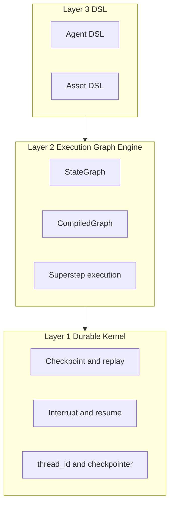

# Oris 2.0 Strategy & Evolution Blueprint

This document defines Oris’s architectural positioning, core axioms, and a two-year evolution plan. It is the single source of truth for “why Oris exists” and “where Oris is going.”

---

## 1. Oris in one sentence

**Oris is the execution kernel for reasoning processes: durable, interruptible, and replayable by design.**

Unlike generic workflow engines, Oris manages the full lifecycle of *reasoning*—the multi-step, non-deterministic decision-making that involves LLMs, tools, and human-in-the-loop—as a first-class execution model.

---

## 2. Architecture: three layers

Oris is structured as three conceptual layers. Today, most implementation lives in **Layer 2**; **Layer 1** is partially in place; **Layer 3** is future work.

### 2.1 Layer mapping to code and status

| Layer | Concept | Current code / modules | Status |
|-------|---------|------------------------|--------|
| **Layer 3** | Agent DSL / Asset DSL | — | **To build.** High-level authoring and Requirement → ExecutionGraph compilation. |
| **Layer 2** | Execution Graph Engine | `graph/graph.rs`, `graph/compiled.rs`, `graph/execution/superstep.rs`, `graph/execution/scheduler.rs`, `graph/edge.rs`, `agent/*` | **Current focus.** StateGraph, CompiledGraph, invoke, superstep, agent loop. |
| **Layer 1** | Durable Kernel | `graph/execution/durability.rs`, `graph/persistence/*` (checkpointer, memory, sqlite, snapshot), `graph/interrupts/*` | **Partial.** Checkpoint (Exit/Async/Sync), thread_id, interrupt/resume, checkpointer trait. Needs: deterministic scheduler, event log index, snapshot compression, state schema migration. |

### 2.2 Oris vs Temporal (why we’re not “Temporal for agents”)

| Dimension | Temporal | Oris |
|-----------|----------|-----|
| **Execution unit** | Activity invocation (RPC-like step) | Graph node / reasoning step (stateful, LLM + tools) |
| **State model** | Workflow args + activity results; replay = replay history | Reasoning state: graph state + messages/context; merge and versioning per step |
| **Interrupt semantics** | Signal (fire-and-forget or request-response) | Interrupt: hand off *current reasoning state and context* to human/policy; resume with a *value* that continues the process |
| **Replay / determinism** | Replay workflow history; activities are side-effect boundaries | Replay reasoning trace; tool/LLM calls are effect boundaries (mock/stub for true determinism) |
| **Granularity** | Workflow and activity level | Step (node) level; fine-grained checkpoint and resume |

Temporal is built for *workflow* durability and retries. Oris is built for *reasoning process* durability: the same run can be interrupted, resumed, restarted, or replayed with a defined state model and interrupt contract.

---

## 3. Core axioms (first principles)

These axioms answer: **Why can’t Temporal (or a generic workflow engine) directly support reasoning execution?**

1. **Reasoning is non-deterministic multi-step decision-making.** Each step can involve LLM output and tool results. The system must maintain a *stateful reasoning trace* (graph state + messages/context), not just a workflow history of activity calls.

2. **Interrupt semantics are “hand off state and context, then resume with a value.”** The runtime must expose the current reasoning state and the question/context to an external policy or human, and accept a resume value that continues execution. This is not a simple signal; it is a first-class contract of the execution model.

3. **Replay and reproducibility require a reasoning trace and effect boundaries.** Replay means re-running from a checkpoint with a well-defined boundary for non-deterministic effects (LLM, tools). The kernel must support checkpointing the graph state and, in the future, recording or stubbing those effects for deterministic replay.

4. **The unit of execution is a graph node (reasoning step), not an activity call.** Scheduling, checkpointing, and interruption are defined at the level of “which node ran, what state we have, what’s next.” This aligns with how agents and planners reason (steps, not RPCs).

5. **State is “graph state + messages/context” with merge and versioning.** The durable abstraction is not “workflow parameters + activity results” but a state type that supports merge (e.g. message append), versioning, and schema evolution over time.

From these axioms, **Oris’s abstract boundary** is:

- **In scope:** Definition, execution, persistence, interruption, resumption, and replay of *reasoning processes* (graph-based, with LLM and tools as effects).
- **Out of scope:** Generic business workflow orchestration, raw data pipelines, or “any” durable job system. Oris does not replace Temporal for non-reasoning workflows.

---

## 4. Two-year evolution blueprint

Recommended path: **first strengthen the Rust Agent Execution Kernel (Phase 1), then introduce the asset layer (Phase 2), then explore Reasoning OS (Phase 3).** Do not skip to asset or policy layers before the kernel is production-ready.

### Phase 1 — Stable 2.0 kernel (≈ 3–6 months)

**Goal:** “Production-ready Agent Runtime.” Durable execution is rock-solid; crash-safe replay and operator tooling exist.

**Focus areas:**

- Harden `graph/execution/` and `graph/persistence/`: deterministic scheduler, event log index, snapshot compression, state schema migration (direction and priority only; implementation in follow-up work).
- CLI / operator tooling: run, resume, list checkpoints, inspect state.
- Trace system: observable execution (steps, interrupts, resume) for debugging and audit.

**Acceptance criteria:**

1. For a given `thread_id`, after a process crash, the run resumes from the latest checkpoint and produces a consistent outcome (or a well-defined error).
2. Replay from a specified `checkpoint_id` is supported and documented.
3. At least one production-ready checkpointer backend (e.g. SQLite or Postgres) is stable and tested.
4. A minimal CLI or operator API can: start a run, list checkpoints, resume by `thread_id` (and optionally `checkpoint_id`).
5. Trace or observability surface exposes: steps executed, interrupt points, and resume events for a run.

---

### Phase 2 — Asset layer (≈ 6–12 months)

**Goal:** “Execution as Asset.” Executions are first-class assets with schema, lineage, and governance.

**Focus areas:**

- Asset schema: define what an “execution asset” is (e.g. graph definition, requirement reference, run id, checkpoint refs).
- Requirement → ExecutionGraph compilation or mapping (Layer 3 → Layer 2).
- Audit model: who started/resumed, when, with what config.
- Compliance and org collaboration: optional metadata and policies around who can interrupt/resume and what tools are allowed.

**Acceptance criteria:**

1. An Asset schema is defined and documented; at least one reference implementation stores execution metadata as assets.
2. A path exists from a “requirement” or high-level spec to an ExecutionGraph (e.g. compiler or builder).
3. Audit trail: for a run, it is possible to see who triggered it, who resumed it, and from which checkpoint.
4. Documentation describes how Asset DSL (or Agent DSL) compiles down to Layer 2 StateGraph.

---

### Phase 3 — Reasoning OS (≈ 12–24 months)

**Goal:** “Reasoning infrastructure as a standard.” Skill registry, execution economics, multi-agent governance, policy kernel.

**Focus areas:**

- Skill registry: discoverable, versioned capabilities that the runtime can invoke.
- Execution economics: cost, limits, budgeting for LLM and tool use.
- Multi-agent governance: policies over multiple agents (who can interrupt, scope of tools).
- Policy kernel: who can interrupt/resume, tool permission scope, LLM provider governance.

**Acceptance criteria:**

1. A skill registry (or equivalent) allows registering and resolving capabilities by name/version.
2. Execution runs can be constrained by cost or budget (e.g. max tokens, max tool calls).
3. A policy layer defines at least: “who can interrupt/resume” and “which tools are allowed for this run.”
4. Documented stance on “asset-first vs reasoning-kernel-first” and how Phase 3 aligns with path B (Reasoning OS) and path C (asset-driven).

This phase is intentionally **research-oriented**; priorities may shift based on Phase 1–2 outcomes and ecosystem feedback.

---

## 5. Risks and trade-offs

- **Concept creep; abstraction not sharp enough.** Mitigation: use the **core axioms** and **Oris in one sentence** as the litmus test. Any feature that does not clearly serve “durable, interruptible, replayable reasoning processes” should be questioned. Keep README and docs aligned with this positioning (e.g. “Why Oris is different from Temporal” linking here).

- **Path choice.** Commit to **“strongest Rust Agent Execution Kernel first, then asset layer, then Reasoning OS.”** Do not jump to asset or policy layers before the kernel is trusted for critical flows. The biggest differentiator is durable execution + replay + interrupt semantics; that must be production-grade before expanding scope.

- **Competition with Temporal / LangGraph / Ray.** Oris does not replace Temporal for general workflows. It targets *reasoning* execution. The comparison table in §2.2 and the axioms in §3 are the basis for clear messaging and prioritization.

---

## 6. References

- [README](../README.md) — product summary and quick start.
- [Durable execution: crash recovery and replay](durable-execution.md) — resume from latest, replay from checkpoint_id, operator API.
- [Public API (stable)](../README.md#public-api-stable) — `oris_runtime::graph`, `oris_runtime::agent`, `oris_runtime::tools`.
- Code: `crates/oris-runtime/src/graph/` (execution, persistence, interrupts), `crates/oris-runtime/src/agent/`, [durable_agent_job](../crates/oris-runtime/examples/durable_agent_job.rs) example.

---

## 7. Current baseline and gap map (as of February 17, 2026)

This section translates the strategy into concrete “done vs next” work.

### 7.1 What is already in place

- Kernel module exists (`crates/oris-runtime/src/kernel/*`) with:
  - Event model (`Event`, `EventStore`, `SequencedEvent`)
  - Driver (`run_until_blocked`, `resume`, `replay`, `replay_from_snapshot`)
  - Policy layer (`AllowListPolicy`, `RetryWithBackoffPolicy`)
  - Snapshot with `at_seq`
- Graph persistence and interrupt flows are integrated with thread identity (`thread_id`) and checkpoint history.
- Operator examples exist:
  - `crates/oris-runtime/examples/cli_durable_job.rs`
  - `crates/oris-runtime/examples/durable_agent_job_sqlite.rs`
- Architecture and API intent are documented in:
  - `docs/kernel-api.md`
  - `docs/durable-execution.md`

### 7.2 What is not yet production-closed for Phase 1

1. **Public API boundary is still too broad**  
   `oris_runtime::lib` exports many domains; “kernel-first” boundary is documented but not enforced by crate structure and feature gates.

2. **Event store backend is in-memory only at kernel layer**  
   SQLite exists for graph checkpoints, but kernel-level durable event log backend and migration strategy are not yet formalized.

3. **Observability is not operator-grade yet**  
   Trace exists, but metrics/log correlation (run_id/step_id/action_id) and audit export contract are incomplete.

4. **Refactor debt in module ownership**  
   Logic is split across graph execution, persistence, and kernel adapters; ownership and dependency direction need hardening.

5. **Release gates are not encoded as a mandatory test matrix**  
   Need CI gates for crash-recovery, replay determinism, interrupt-resume correctness, and policy retry semantics.

---

## 8. 12-week execution plan (kernel hardening first)

Timebox: **Wave 1–3**, starting **February 23, 2026**.  
Rule: No Phase 2 expansion until all Wave 3 acceptance checks pass.

### Wave 1 (weeks 1-4): boundary and reliability hardening

**Work packages**

1. API boundary refactor
   - Freeze kernel-facing contracts in `kernel/*` and adapter contracts in graph.
   - Minimize cross-module coupling from `graph/*` into kernel internals.
   - Add explicit “stable vs internal” doc blocks to exported symbols.

2. Deterministic replay contract tests
   - Add scenario tests for:
     - replay equivalence (same log => same state)
     - replay without executor side effects
     - replay from snapshot tail (`at_seq + 1`)
   - Cover both in-memory and sqlite-persistence feature paths where applicable.

3. Failure model cleanup
   - Normalize recoverable vs non-recoverable error mapping in driver/adapter path.
   - Ensure ActionRequested always has exactly one terminal result event.

**Wave 1 acceptance**

- Kernel and graph adapter tests pass for replay/interrupt/retry core scenarios.
- Public API notes clearly identify which symbols are stable in 0.1.x.

### Wave 2 (weeks 5-8): observability and operator flow

**Work packages**

1. Trace unification
   - Standardize fields: `run_id`, `step_id`, `action_id`, `checkpoint_id`, `seq`.
   - Keep existing `TraceEvent` compatibility while providing a normalized view for operators.

2. CLI/operator parity upgrade
   - Extend `cli_durable_job` workflow:
     - inspect latest state
     - inspect checkpoint by id
     - replay dry-run from checkpoint
   - Document exact runbooks for crash and resume operations.

3. Persistence and audit shape
   - Define minimal audit payload format for start/resume/replay actions.
   - Document retention and compaction expectations for checkpoint/event growth.

**Wave 2 acceptance**

- Operator can run a full lifecycle (`run -> interrupt -> resume -> list -> replay`) from CLI.
- Trace output can be correlated end-to-end for one `thread_id` / `run_id`.

### Wave 3 (weeks 9-12): release gating and migration readiness

**Work packages**

1. Release test matrix in CI
   - Required suites:
     - crash recovery with sqlite persistence
     - deterministic replay invariants
     - policy retry/backoff behavior
     - interrupt/resume contract

2. Data compatibility and migration note
   - Define checkpoint/event schema compatibility policy for 0.1.x -> 0.2.x.
   - Add migration playbook (how to upgrade without losing resumability).

3. Production readiness checklist
   - Publish a single “Phase 1 ready” checklist and mark each criterion pass/fail.
   - Block Phase 2 work until checklist reaches “all pass”.

**Wave 3 acceptance**

- CI enforces the Phase 1 gates as blocking checks.
- Upgrade guidance exists and is validated on a sample persisted run set.

---

## 9. Transition criteria from Phase 1 to Phase 2

Phase 2 (asset layer) may start only when all criteria below are met:

1. Replay from checkpoint is deterministic and covered by CI (not only examples).
2. Crash recovery with persisted backend is verified in automated tests.
3. Operator tooling supports run/resume/list/replay/inspect as documented.
4. Trace and audit fields are stable enough for external integration.
5. Public module boundary for kernel/graph/agent is explicitly documented and respected.
