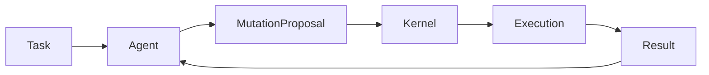

# Oris Agent Runtime Contract Specification

Source: https://www.notion.so/317e8a70eec5808b9b0bd35bc45b4e91

Last synced: March 2, 2026

## 1. Purpose

This document defines how agents interact with the Oris kernel. Agents are
external intelligence executors bound by a strict runtime contract.

This separation guarantees:

- kernel stability
- deterministic evolution
- safe agent interoperability
- multi-agent compatibility

## 2. Architectural Position

Agents operate above the kernel boundary:

```text
Agent
v
Agent Runtime Contract
v
Mutation Interface
v
Oris Kernel
```

Agents never directly modify system state.

## 3. Agent Design Philosophy

An Oris agent is:

> A mutation proposal generator operating under deterministic execution constraints.

Agents:

- propose actions
- generate mutations
- interpret results

Agents do not:

- persist intelligence
- modify evolution assets
- bypass validation
- access kernel internals

## 4. Agent Responsibilities

Agents must provide:

1. Task interpretation
2. Mutation proposal
3. Execution reasoning
4. Result interpretation

The kernel handles:

- execution
- validation
- evolution
- replay
- governance

## 5. Agent Runtime Lifecycle



Lifecycle stages:

- task intake
- mutation proposal
- kernel execution
- result feedback
- iteration

## 6. Mutation Contract

Agents express change as a mutation proposal:

```rust
struct MutationProposal {
    intent: String,
    files: Vec<Path>,
    expected_effect: String,
}
```

The kernel converts this into executable mutation state.

Contract rules:

- no direct filesystem access
- no execution privileges
- no state persistence
- no evolution authority

## 7. Agent Context Model

Context may include:

- task description
- execution feedback
- replay hints
- selected capsules

Agents must remain stateless and cannot rely on hidden memory.

## 8. Replay-Aware Execution

Before agent reasoning:

```text
Kernel attempts Replay
```

If replay succeeds, agent reasoning is skipped. Agents must tolerate
non-invocation.

## 9. Multi-Agent Compatibility

Compatible agents may include:

- Codex-based coding agents
- Claude-style reasoning agents
- autonomous planners
- domain-specific repair agents

Interoperability comes from the shared mutation contract.

## 10. Agent Isolation

Agents execute outside the kernel trust boundary. This preserves:

- kernel integrity
- evolution safety
- deterministic history

Agents are replaceable.

## 11. Agent Capability Levels

| Level | Capability |
| --- | --- |
| A0 | Single mutation |
| A1 | Iterative repair |
| A2 | Planning agent |
| A3 | Multi-step executor |
| A4 | Cooperative agent |

Higher capability does not grant higher trust.

## 12. Agent Failure Handling

Failure includes:

- invalid mutation
- unsafe proposal
- repeated validation failure

Kernel response:

- reject mutation
- request retry
- fallback replay
- terminate session

Evolution remains unaffected.

## 13. Agent Observability

Metrics:

- proposal success rate
- validation pass ratio
- replay avoidance rate
- mutation efficiency

Used for evaluation, not evolution authority.

## 14. Agent Upgrade Model

Agents may evolve independently. The kernel preserves backward compatibility via
contract stability.

## 15. Non-Goals

Agents must not:

- rewrite kernel modules
- alter evolution store
- bypass governor checks
- publish network assets directly

## 16. Long-Term Vision

```text
Agents compete
Kernel evolves
System improves
```

Oris separates intelligence generation from intelligence survival.

## 17. Repository Placement

```text
oris/
`- agents/
   |- codex/
   |- planner/
   |- repair/
   `- experimental/
```

## 18. Completion Criteria

Integration is complete when:

- agents operate without kernel modification
- replay replaces repeated reasoning
- multiple agents coexist safely
- evolution remains deterministic
