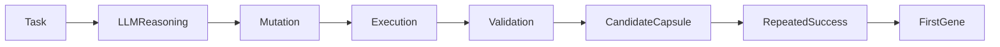

# Oris Evolution Bootstrap Specification

Source: https://www.notion.so/317e8a70eec5808892d5e97a9d8d5de7

Last synced: March 2, 2026

## 1. Purpose

Bootstrap defines how Oris produces its first verified experience and first
gene. Without bootstrap, evolution remains permanently dependent on LLM
reasoning.

## 2. The Bootstrap Problem

At startup:

```text
No Genes
No Capsules
No Replay
```

Therefore:

```text
Selector -> Empty
Replay -> Impossible
Evolution -> Blocked
```

This is the cold evolution state. Bootstrap transitions the system into active
evolution.

## 3. Bootstrap Principles

### 3.1 Reasoning Seeds Evolution

LLM reasoning is temporarily required as an initial mutation generator.

### 3.2 Execution Creates Intelligence

Only validated execution outcomes may produce assets.

### 3.3 Early Evolution Must Be Conservative

First assets have outsized influence, so promotion thresholds must be strict.

## 4. Bootstrap Lifecycle



## 5. Bootstrap Modes

### 5.1 Assisted Bootstrap (Recommended)

Human or scripted tasks drive early execution.

Example task classes:

- compilation fixes
- dependency resolution
- retry logic
- error handling
- test stabilization

### 5.2 Autonomous Bootstrap

Real tasks arrive immediately. This is faster but riskier and requires stricter
governor enforcement.

## 6. Bootstrap Task Selection

Ideal tasks are:

- deterministic
- frequently repeated
- low blast radius
- easy to validate

Examples:

| Category | Example |
| --- | --- |
| Build repair | `cargo check` failure |
| Panic removal | `unwrap` replacement |
| Retry logic | transient network error |
| Logging fixes | missing diagnostics |

Avoid architectural mutations early.

## 7. First Capsule Creation

During bootstrap:

```text
Validation PASS
-> Candidate Capsule
```

Rules:

- never auto-promote
- require repeated reuse
- require replay confirmation

Minimum requirement:

```text
success_count >= 3
```

## 8. First Gene Formation

Gene creation occurs when multiple capsules share:

- similar signals
- similar mutation intent
- consistent success outcome

Process:

```text
Cluster Capsules
-> Extract Strategy Pattern
-> Create Gene
```

This is the point where evolution begins.

## 9. Bootstrap Governor Policy

| Control | Setting |
| --- | --- |
| Mutation Rate | Low |
| Promotion Threshold | High |
| Cooling Window | Long |
| Blast Radius | Strict |

Bootstrap favors safety over speed.

## 10. Bootstrap Completion Criteria

Bootstrap ends when:

- replay succeeds without LLM
- the same failure auto-resolves
- at least one promoted gene exists
- the selector returns reusable capsules

The system then enters self-sustaining evolution.

## 11. Bootstrap Metrics

- reasoning usage ratio
- replay success rate
- candidate capsule growth
- first promotion latency

Healthy bootstrap shows gradual replay adoption.

## 12. Common Bootstrap Failures

Over-promotion:

- weak strategies dominate too early
- mitigation: raise thresholds and repeat validation

Mutation explosion:

- too many early candidates
- mitigation: rate limiting and cooling

Hallucinated success:

- reasoning mistaken for correctness
- mitigation: strict validation gates and replay verification

## 13. Recommended Bootstrap Timeline

| Stage | Duration |
| --- | --- |
| Cold Start | Day 0-3 |
| Candidate Growth | Day 3-10 |
| First Gene | Day 10-20 |
| Replay Emergence | Day 20-30 |

## 14. Transition to Normal Evolution

After bootstrap:

```text
exploration increases
promotion speed increases
network sharing enabled
```

The system moves from learning phase to evolution phase.

## 15. Long-Term Insight

Bootstrap is not training. It is:

```text
the birth of executable intelligence memory
```

Once completed, Oris improves through execution history indefinitely.
