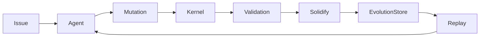

# Oris Self-Accelerating Development Loop

Source: https://www.notion.so/317e8a70eec58037987ffb3c0c7b0be7

Last synced: March 2, 2026

## 1. Purpose

DEVLOOP defines how Oris develops itself using AI coding agents. It establishes
a closed feedback system where:

- AI agents develop Oris
- Oris captures successful development patterns
- evolution improves future development
- development speed continuously increases

Goal:

> Oris becomes a system that accelerates its own construction.

## 2. Core Concept

Traditional development:

```text
Human -> Code -> Commit -> Repeat
```

AI-assisted development:

```text
Human -> AI -> Code -> Repeat
```

Oris development loop:

```text
Task
-> Agent Coding
-> Kernel Execution
-> Validation
-> Evolution Capture
-> Replay Reuse
-> Faster Future Coding
```

Development itself becomes evolutionary.

## 3. Development Roles

Human developer:

- defines direction
- approves architecture
- supervises evolution boundaries

Coding agent:

- mutation proposals
- implementation generation
- repair iterations

Oris kernel:

- execution correctness
- evolution capture
- replay optimization
- stability enforcement

## 4. DEVLOOP Lifecycle



Each successful development step improves future steps.

## 5. Development as Evolution

Every successful coding action becomes:

- Gene: development strategy
- Capsule: verified implementation pattern

Examples:

| Development Action | Evolution Asset |
| --- | --- |
| Fix async bug | concurrency repair gene |
| Add retry logic | resilience gene |
| Refactor module | structure optimization gene |
| Write tests | validation gene |

## 6. Coding Session Integration

Captured automatically:

- prompt intent
- generated diff
- execution outcome
- validation result
- replay success

Agents remain unaware of evolution capture.

## 7. Replay-Driven Development

Before coding begins:

```text
Kernel checks evolution store
```

If a solution exists:

- apply known patch
- skip reasoning
- shorten development cycle

Development shifts from invention to reuse.

## 8. Self-Acceleration Effect

```text
Initial Phase:
LLM reasoning dominates

Middle Phase:
Replay assists development

Late Phase:
Replay replaces reasoning
```

Development speed increases non-linearly.

## 9. Safe Development Constraints

DEVLOOP obeys:

- all changes via mutation boundary
- validation required
- governor approval enforced
- replay verification mandatory

Agents cannot directly modify repository state.

## 10. Development Task Classes

High value:

- bug repair
- build stabilization
- performance optimization
- testing automation

Medium value:

- refactoring
- interface cleanup

Low value:

- cosmetic formatting
- documentation-only edits

High-repetition tasks accelerate evolution.

## 11. Continuous Evolution Pipeline

```text
Issue
-> Agent Implementation
-> Kernel Execution
-> Validation
-> Evolution Capture
-> Replay Availability
```

No manual evolution step is required.

## 12. Multi-Agent Development

Multiple agents may operate concurrently:

- planner agent
- coding agent
- repair agent
- optimization agent

The kernel ensures deterministic convergence. Agents compete; evolution selects.

## 13. Development Metrics

- reasoning calls per task
- replay utilization rate
- mutation success ratio
- implementation latency
- evolution growth rate

Healthy DEVLOOP shows declining reasoning dependency.

## 14. Bootstrap Interaction

DEVLOOP drives bootstrap completion. Repeated development tasks generate first
genes automatically.

## 15. Long-Term Emergence

```text
Oris improves Oris
```

Typical outcomes:

- recurring bugs disappear
- architectural patterns stabilize
- implementation style converges
- development velocity increases

## 16. Failure Modes

Over-automation:

- agents generate excessive mutations
- mitigation: governor rate limits

Evolution bias:

- one strategy dominates
- mitigation: selector exploration

Replay overreach:

- outdated solutions reused
- mitigation: confidence decay

## 17. Recommended Repository Workflow

```text
feature branch
-> agent development
-> kernel validation
-> evolution capture
-> merge
```

Evolution becomes part of CI/CD.

## 18. DEVLOOP Completion Criteria

- repeated engineering problems auto-resolve
- agent iterations decrease
- replay reuse dominates development
- system stability increases over time

## 19. Strategic Outcome

```text
Self-Accelerating Software System
```

## 20. Vision Statement

Oris development moves from:

```text
building software
```

to:

```text
building a system that learns how to build itself
```
