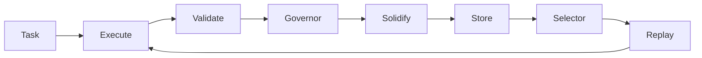

# Oris Minimal Evolution Kernel Specification

Source: https://www.notion.so/317e8a70eec58055bd75dc70f680d4c1

Last synced: March 2, 2026

## 1. Purpose

This defines the minimal executable core of Oris: the smallest system capable of
supporting deterministic execution, verified evolution, safe inheritance, and
replay-based learning.

## 2. Kernel Definition

Oris is not an agent framework. It is an evolution execution kernel.

```text
Oris Kernel =
Deterministic Execution
+
Validation Boundary
+
Evolution Solidification
+
Selection and Replay
```

If any component is missing, evolution cannot occur.

## 3. Kernel Responsibilities

The kernel must guarantee:

1. Execution determinism
2. Mutation isolation
3. Validation correctness
4. Immutable evolution history
5. Safe behavioral reuse

The kernel must not:

- depend on specific LLM providers
- embed reasoning logic
- self-modify kernel code
- trust external input automatically

## 4. Kernel Architecture

```text
Task
v
Execution Engine
v
Mutation Boundary
v
Sandbox Runtime
v
Validator
v
Governor Gate
v
Solidify Engine
v
Evolution Store
v
Selector
v
Replay Executor
```

## 5. Core Kernel Modules

### 5.1 Execution Engine

Required properties:

- step-based execution
- retry consistency
- interrupt recovery
- replay reproducibility

```rust
trait Executor {
    fn execute(task: Task) -> ExecutionResult;
}
```

### 5.2 Mutation Boundary

All change passes through mutation.

```rust
struct Mutation {
    intent: String,
    target: Target,
    risk: RiskLevel,
}
```

Purpose:

- auditability
- rollback capability
- evolution traceability

### 5.3 Sandbox Runtime

Requirements:

- isolated filesystem
- limited permissions
- execution timeout
- restricted command surface

```rust
trait Sandbox {
    fn apply(mutation: Mutation) -> ExecutionResult;
}
```

### 5.4 Validator

Validation examples:

- compilation success
- test verification
- runtime stability
- replay equivalence

```rust
trait Validator {
    fn validate(result: ExecutionResult) -> ValidationReport;
}
```

Evolution proceeds only if validation succeeds.

### 5.5 Governor Gate

Checks:

- mutation rate
- blast radius
- regression signals
- cooldown state

```rust
trait Governor {
    fn approve(candidate: EvolutionCandidate) -> Decision;
}
```

### 5.6 Solidify Engine

Produces:

- gene
- capsule
- evolution event

```rust
trait Solidifier {
    fn solidify(exec: ExecutionResult) -> EvolutionAssets;
}
```

### 5.7 Evolution Store

Immutable append-only storage:

- content-addressed
- replayable
- auditable

```rust
trait EvolutionStore {
    fn append(asset: Asset);
}
```

### 5.8 Selector

Chooses reusable intelligence from:

- runtime signals
- historical fitness

```rust
trait Selector {
    fn select(signals: Vec<Signal>) -> Vec<Capsule>;
}
```

### 5.9 Replay Executor

```text
Detect Signals
-> Select Capsule
-> Apply Patch
-> Validate
```

Fallback to reasoning if replay fails.

## 6. Kernel Data Flow



## 7. Kernel Invariants

- I1: deterministic replay
- I2: validation before evolution
- I3: immutable history
- I4: local authority
- I5: kernel stability

## 8. Minimal Kernel Implementation Order

1. Executor
2. Validator
3. Evolution Store
4. Solidifier
5. Selector
6. Replay Executor
7. Governor

Network and economics follow afterward.

## 9. Kernel Boundary

The kernel ends at:

```text
Replay Decision
```

Outside scope:

- agents
- planners
- UI
- network transport
- economic incentives

## 10. Failure Recovery Model

The kernel must support:

- rollback via replay
- asset revocation
- promotion freeze
- execution restart

Failure must never corrupt history.

## 11. Observability

Metrics:

- replay success rate
- validation pass rate
- mutation frequency
- promotion ratio
- execution determinism score

## 12. Reference Repository Layout

```text
oris/
`- kernel/
   |- executor/
   |- mutation/
   |- sandbox/
   |- validator/
   |- governor/
   |- solidify/
   |- store/
   |- selector/
   `- replay/
```

## 13. Kernel Completion Criteria

The kernel is complete when:

- repeated failures auto-resolve via replay
- reasoning calls decrease over time
- execution outcomes stabilize
- evolution assets accumulate safely

## 14. Long-Term Role

```text
Operating System for Intelligence Evolution
```

Higher layers extend capability; the kernel guarantees survival and correctness.
