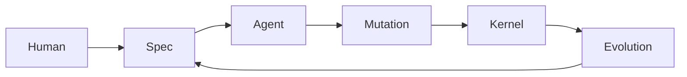

# Oris Unified Specification Language (OUSL)

Source: https://www.notion.so/317e8a70eec580de9ea1df0f825fffcd

Last synced: March 2, 2026

## 1. Purpose

OUSL is the bridge between:

```text
Human Intent -> Agent Execution -> Evolution -> Code
```

It transforms structured requirements into executable mutations and evolvable
intelligence assets.

## 2. Problem Statement

Modern development is fragmented:

| Layer | Representation |
| --- | --- |
| PRD | Natural language |
| Design | Diagrams |
| Code | Implementation |
| Agent Prompt | Ephemeral |
| Evolution | Missing |

There is no persistent structure connecting intent to execution. OUSL provides
one canonical specification layer.

## 3. Core Principle

Specification becomes the first-class executable artifact:

```text
Spec -> Mutation -> Execution -> Evolution -> Replay
```

Code is no longer primary. Specification is.

## 4. Specification Role in Oris

OUSL sits between agents and kernel:



Specifications evolve alongside execution history.

## 5. Specification Structure

A spec defines:

- intent
- constraints
- expected behavior
- validation rules
- evolution signals

Minimal schema:

```yaml
spec:
  id: retry_api_call
  intent: improve reliability

  signals:
    - timeout_error
    - connection_reset

  constraints:
    max_latency: 200ms

  mutation:
    strategy: retry_with_backoff

  validation:
    - integration_test
```

## 6. Spec Lifecycle

```text
Draft
-> Executed
-> Validated
-> Evolvable
-> Optimized
```

Specs improve through execution feedback.

## 7. Spec to Mutation Mapping

```text
Spec.intent
-> Mutation.intent

Spec.strategy
-> Code change

Spec.validation
-> Validator rules
```

The kernel never executes raw natural language.

## 8. Spec Signals

Signals link execution outcomes back to specs. Sources:

- runtime errors
- performance metrics
- validation failures
- replay success

## 9. Evolution Feedback into Specs

After repeated successful capsules:

```text
Capsules cluster
-> Strategy improvement
-> Spec refinement
```

Example:

```text
initial: retry_once
evolved: exponential_backoff
```

## 10. Spec Versioning

Specs are immutable. Changes create new versions:

```text
spec:v1
spec:v2
spec:v3
```

## 11. Spec Determinism Rules

Specs must be:

- machine-readable
- validation-bound
- execution-mappable
- environment-aware

Ambiguous intent is rejected.

## 12. Spec Categories

- behavioral specs
- structural specs
- repair specs
- optimization specs
- evolution specs

## 13. Spec Storage

```text
/specs
  |- behavior/
  |- repair/
  |- optimization/
  `- evolution/
```

Specs become repository-native assets.

## 14. Spec Execution Flow


## 15. Spec Governance

The governor enforces:

- mutation safety
- validation correctness
- evolution eligibility

Specs cannot bypass kernel rules.

## 16. Spec Replay Integration

```text
Signal
-> Spec Match
-> Capsule Replay
```

Specs accelerate reuse discovery.

## 17. Spec and Agents

Agents interpret specs but do not own them. Agents are replaceable; specs remain
stable intelligence interfaces.

## 18. Spec Anti-Drift Protection

- validation binding
- replay verification
- confidence decay
- periodic spec reevaluation

## 19. Long-Term Emergence

```text
PRD
-> Executable Spec
-> Self-Optimizing System
```

Organizations describe systems instead of coding them directly.

## 20. Strategic Outcome

```text
Intent
-> Spec
-> Mutation
-> Execution
-> Evolution
-> Improved Spec
```

Software becomes an evolving specification rather than static code.
